# 💫 About Me:
### 👋 About Me  I'm a Biotechnology student exploring **Bioinformatics, Computational Biology, and AI/ML** to solve real-world problems in healthcare and life sciences. I'm currently working on projects involving **medical imaging, cancer analysis, disease detection, and data-driven biological research**.  🔬 Interested in **Bioinformatics • Computational Biology • Medical AI • Machine Learning • Biomedical Research**  🚀 Currently exploring how **AI and computational methods can accelerate biological and healthcare research**. 

## 🌐 Socials:
  

# 💻 Tech Stack:
                                 
# 📊 GitHub Stats:
 
 

## 🏆 GitHub Trophies

  

### ✍️ Random Dev Quote

### 🔝 Top Contributed Repo
🧠 NeuroVision AI — Brain MRI Analysis
AI-assisted framework for brain MRI analysis combining image preprocessing, U-Net segmentation, YOLO-based detection and Grad-CAM explainability.

👁️ OpticNova — Eye Disease Detection
AI-based eye disease analysis targeting conditions such as Glaucoma, Diabetic Retinopathy and AMD, using medical imaging datasets and AI models.

🌱 Aquarevive — Greywater Purification
A biotechnology project exploring algae-based greywater purification using Chlorella vulgaris and Spirulina platensis.

🧮 Carbon Footprint Calculator
A web-based application designed to estimate and visualize carbon emissions based on user inputs.

🚨 SOS Detection
A technology-based project focused on detecting emergency situations and providing rapid assistance.

<!-- Proudly created with GPRM ( https://gprm.itsvg.in ) -->
